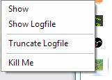
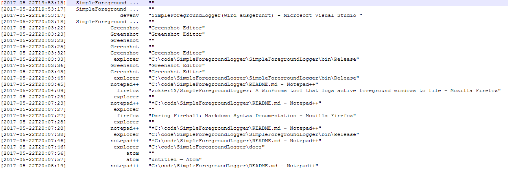

# SimpleForegroundLogger
A WinForms tool that logs active foreground windows to file

## What?
Sometimes, I have windows that steal focus for my input.
I want to detect those windows and hook them upon their start and kill them.

They drive me nuts.

This tool will take care about the grabbing of the windows.

## Screens
### Useless mainscreen:

### Management tray:

### Logfile contents:

## Todo
* Add Filtering so whitelisted windows don't spam the logs
* Add location for logfile
